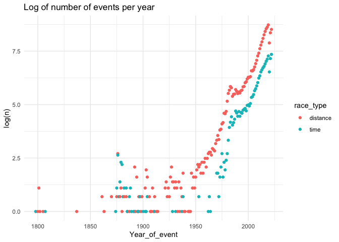
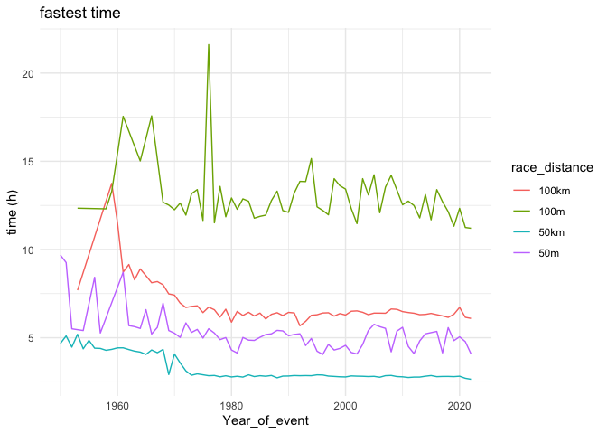
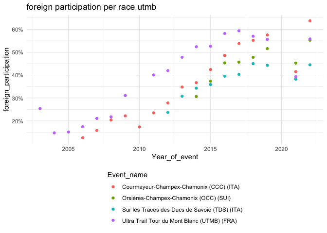

## 1. Introduction

### 1.1 Load and check data

First let’s load the required libraries and dataset

    library(data.table)
    library(dplyr)
    library(magrittr)
    library(ggplot2)
    library(gridExtra)
    library(scales)
    library(stringr)
    library(tidyr)
    library(lubridate)

    data <- fread('./data/TWO_CENTURIES_OF_UM_RACES.csv', sep = ',', header = TRUE)
    summary(data)

    ##  Year of event  Event dates         Event name        Event distance/length
    ##  Min.   :1798   Length:7461195     Length:7461195     Length:7461195       
    ##  1st Qu.:2010   Class :character   Class :character   Class :character     
    ##  Median :2015   Mode  :character   Mode  :character   Mode  :character     
    ##  Mean   :2012                                                              
    ##  3rd Qu.:2018                                                              
    ##  Max.   :2022                                                              
    ##                                                                            
    ##  Event number of finishers Athlete performance Athlete club      
    ##  Min.   :    0             Length:7461195      Length:7461195    
    ##  1st Qu.:   88             Class :character    Class :character  
    ##  Median :  235             Mode  :character    Mode  :character  
    ##  Mean   : 1452                                                   
    ##  3rd Qu.:  867                                                   
    ##  Max.   :20027                                                   
    ##                                                                  
    ##  Athlete country    Athlete year of birth Athlete gender    
    ##  Length:7461195     Min.   :1193          Length:7461195    
    ##  Class :character   1st Qu.:1962          Class :character  
    ##  Mode  :character   Median :1971          Mode  :character  
    ##                     Mean   :1970                            
    ##                     3rd Qu.:1979                            
    ##                     Max.   :2021                            
    ##                     NA's   :588161                          
    ##  Athlete age category Athlete average speed   Athlete ID     
    ##  Length:7461195       Length:7461195        Min.   :      0  
    ##  Class :character     Class :character      1st Qu.: 135712  
    ##  Mode  :character     Mode  :character      Median : 394468  
    ##                                             Mean   : 553626  
    ##                                             3rd Qu.:1037699  
    ##                                             Max.   :1641167  
    ## 

We can see that the dataset has events from 1798 to 2022 and there may
be a few inaccuracies with the dataset, for example it’s unlikely that
anyone was born in 1193 would have run an ultramarathon since 1798. Most
of the other fields are in character type, and so a bit of feature
engineering will be required to make these fields a bit easier to
analyse. We’ll replace the spaces in the column names with underscores
to make analysis slightly easier.

    names(data) <- gsub(" ", "_", names(data))

    (sapply(data, function(x) round(mean(is.na(x) | x == '')*100,2))) %>% 
      as.data.frame(.) %>% 
      setNames("Percent_Missing") %>%
      arrange(desc(Percent_Missing))

    ##                           Percent_Missing
    ## Athlete_club                        37.88
    ## Athlete_year_of_birth                7.88
    ## Athlete_age_category                 7.84
    ## Year_of_event                        0.00
    ## Event_dates                          0.00
    ## Event_name                           0.00
    ## Event_distance/length                0.00
    ## Event_number_of_finishers            0.00
    ## Athlete_performance                  0.00
    ## Athlete_country                      0.00
    ## Athlete_gender                       0.00
    ## Athlete_average_speed                0.00
    ## Athlete_ID                           0.00

A glance at the missing entries shows 38% missing Athlete\_club, along
with 8% missing age related fields. Athlete\_club isn’t too important
for my intial data exploratory analysis and so can be excluded.

    data %>%
      group_by(Year_of_event) %>%
      summarise(missing = sum(is.na(Athlete_year_of_birth)| Athlete_year_of_birth == ""),
                perc_missing = mean(is.na(Athlete_year_of_birth) | Athlete_year_of_birth == "")) %>%
      arrange(desc(missing))

    ## # A tibble: 146 × 3
    ##    Year_of_event missing perc_missing
    ##            <int>   <int>        <dbl>
    ##  1          2019   45910       0.0627
    ##  2          2016   44904       0.0831
    ##  3          2018   44500       0.0673
    ##  4          2015   42929       0.0893
    ##  5          2017   42185       0.0698
    ##  6          2022   40771       0.0865
    ##  7          2014   37275       0.0893
    ##  8          2013   29125       0.0835
    ##  9          2012   23161       0.0775
    ## 10          2021   22947       0.0611
    ## # ℹ 136 more rows

The participants with missing year of birth/age category doesn’t appear
to be concentrated in a particular event or year. The count of these is
the highest in the most recent years, but with a low overall percentage
of missing fields due to higher overall participation numbers. Something
to consider when analysing age or participants.

### 1.2 Data cleaning

Next we’ll clean up some of the fields. There are also almost 1,800
entries that have Country = ‘XXX’ and Athlete\_ID = 4033, with different
genders and age categories, which need to be taken into consideration
when analysing individual athlete results. The race results for these
athletes appear to be correct though, so we’ll leave them in the
dataset.

    filter(data, Athlete_country =='XXX') %>% count(Athlete_country, Athlete_ID)

    ##    Athlete_country Athlete_ID    n
    ## 1:             XXX       4033 1782
    ## 2:             XXX    1069462    1

I’m only going to be considering single stage events, so I’ll be
removing events such as Marathon des Sables (MAR). These can be
identified as they contain “/” in the Event\_distance/length field, for
example “249km/6Etappen”.

    data %>%
        summarise(multievent_perc = mean(grepl('/', `Event_distance/length`)))

    ##   multievent_perc
    ## 1      0.01240163

These entries account for 1.2% of all entries in the dataset, indicating
that most people are running single stage events.

We’ll also extract the location of the race from the Event\_name, which
is contained in the final set of brackets in the Event\_name field. For
example “Ultra Maratón des las Altas Montanas (UMAM) 80 Kms (MEX)” is in
MEX.

    data_clean <- data %>%
      filter(!`Event_distance/length` %like% '/') %>% #filter out stage races
      mutate(race_location = str_extract(Event_name, "\\(([^()]*)\\)(?![^()]*\\()"), 
             race_location = str_replace_all(race_location, "[()]", "")) #location of race from event name

The length of an ultramarathons is either set in distance (eg 100km) or
time (eg 24h), and the Event\_distance/length contains both of these
types, so we’ll flag these seperately and convert all distance length
races into km from miles.

    data_clean %<>%
              mutate(race_distance = as.numeric(str_extract(`Event_distance/length`, "[0-9.]+")), #distance or time of event
             race_unit = tolower(str_extract(`Event_distance/length`, "[a-zA-Z]+")), 
             race_distance = as.numeric(race_distance),
             race_type = if_else(race_unit %in% c('h', 'd'), 'time', 'distance'), #split out distance races from timed
             race_unit = if_else(race_type == 'time', race_unit, 
                            if_else(str_starts(race_unit, 'k'), 'km',
                            if_else(str_starts(race_unit, 'm'), 'm', 'other'))),
             distance_km = if_else(race_unit == 'km', race_distance, if_else(race_unit == 'm', race_distance*1.62, NA))) #convert miles into km

Although the dataset includes an Athlete\_age\_category field, these
aren’t standard across events, with German races using the DLV
categories with the rest of the world using IAAF. This can be seen below
with the categories “M20” and “M30” appearing in German races not not in
the rest of the world. So we’ll add a column for the athlete’s age and
calculate categories separately.

    data_clean %<>%
             mutate(athlete_age = as.numeric(Year_of_event) - as.numeric(Athlete_year_of_birth))

    data_clean %>%
      mutate(location = if_else(race_location == 'GER', 'GER','RoW')) %>%
      count(location, Athlete_age_category) %>%
      pivot_wider(names_from = location, values_from = n) 

    ## # A tibble: 38 × 3
    ##    Athlete_age_category   GER    RoW
    ##    <chr>                <int>  <int>
    ##  1 ""                   19436 557944
    ##  2 "M20"                18373      2
    ##  3 "M30"                22756      1
    ##  4 "M35"                34278 943583
    ##  5 "M40"                45725 995695
    ##  6 "M45"                51554 845161
    ##  7 "M50"                45546 572535
    ##  8 "M55"                28041 318352
    ##  9 "M60"                14379 151518
    ## 10 "M65"                 6369  59417
    ## # ℹ 28 more rows

We’ll convert the Athlete\_performance column into a more usable format,
splitting out the times athlete’s have completed distance based events
into a ‘duration’ formatted field, and the distance travelled for time
based events.

    data_clean %<>%
      mutate( #standardise athlete performance values
             numeric_string = str_extract(Athlete_performance, "\\d+[:d.]+\\d+[:.]*\\d*"),
             athlete_units = str_extract(Athlete_performance, "[a-zA-Z ]+"),
             days = if_else(str_detect(Athlete_performance, "d"), 
                            as.numeric(str_extract(Athlete_performance, "\\d+(?=d)")), 
                            0),
             time = if_else(str_detect(Athlete_performance, ":"), 
                            as.duration(hms(str_extract(Athlete_performance, "(?<=d |^)\\d+:\\d+:\\d+"))), 
                            as.duration(0)),
             athlete_duration = as.duration(days(days)) + time,
             athlete_distance = case_when(
               str_detect(athlete_units, "km") ~ as.numeric(str_replace(numeric_string, "km", "")),
               TRUE ~ NA_real_
             ),
             days = NULL,
             time = NULL,
             numeric_string = NULL
      ) 

    summary(data_clean)

    ##  Year_of_event  Event_dates         Event_name        Event_distance/length
    ##  Min.   :1798   Length:7368664     Length:7368664     Length:7368664       
    ##  1st Qu.:2009   Class :character   Class :character   Class :character     
    ##  Median :2015   Mode  :character   Mode  :character   Mode  :character     
    ##  Mean   :2012                                                              
    ##  3rd Qu.:2018                                                              
    ##  Max.   :2022                                                              
    ##                                                                            
    ##  Event_number_of_finishers Athlete_performance Athlete_club      
    ##  Min.   :    0             Length:7368664      Length:7368664    
    ##  1st Qu.:   89             Class :character    Class :character  
    ##  Median :  236             Mode  :character    Mode  :character  
    ##  Mean   : 1467                                                   
    ##  3rd Qu.:  880                                                   
    ##  Max.   :20027                                                   
    ##                                                                  
    ##  Athlete_country    Athlete_year_of_birth Athlete_gender    
    ##  Length:7368664     Min.   :1193          Length:7368664    
    ##  Class :character   1st Qu.:1962          Class :character  
    ##  Mode  :character   Median :1971          Mode  :character  
    ##                     Mean   :1970                            
    ##                     3rd Qu.:1979                            
    ##                     Max.   :2021                            
    ##                     NA's   :580542                          
    ##  Athlete_age_category Athlete_average_speed   Athlete_ID     
    ##  Length:7368664       Length:7368664        Min.   :      0  
    ##  Class :character     Class :character      1st Qu.: 135804  
    ##  Mode  :character     Mode  :character      Median : 394734  
    ##                                             Mean   : 554066  
    ##                                             3rd Qu.:1039180  
    ##                                             Max.   :1641167  
    ##                                                              
    ##  race_location      race_distance      race_unit          race_type        
    ##  Length:7368664     Min.   :   3.00   Length:7368664     Length:7368664    
    ##  Class :character   1st Qu.:  50.00   Class :character   Class :character  
    ##  Mode  :character   Median :  56.00   Mode  :character   Mode  :character  
    ##                     Mean   :  67.78                                        
    ##                     3rd Qu.:  89.00                                        
    ##                     Max.   :5000.00                                        
    ##                     NA's   :1053                                           
    ##   distance_km      athlete_age     athlete_units     
    ##  Min.   :  24.5   Min.   :-30.0    Length:7368664    
    ##  1st Qu.:  50.0   1st Qu.: 35.0    Class :character  
    ##  Median :  65.0   Median : 42.0    Mode  :character  
    ##  Mean   :  76.0   Mean   : 42.4                      
    ##  3rd Qu.:  90.0   3rd Qu.: 49.0                      
    ##  Max.   :5022.0   Max.   :827.0                      
    ##  NA's   :527722   NA's   :580542                     
    ##  athlete_duration                           athlete_distance 
    ##  Min.   :0s                                 Min.   :   0     
    ##  1st Qu.:22510s (~6.25 hours)               1st Qu.:  56     
    ##  Median :32555s (~9.04 hours)               Median :  79     
    ##  Mean   :39279.3961579683s (~10.91 hours)   Mean   : 104     
    ##  3rd Qu.:45629s (~12.67 hours)              3rd Qu.: 122     
    ##  Max.   :3020399s (~4.99 weeks)             Max.   :2130     
    ##                                             NA's   :6842041

Now the data is correctly formatted, a glimpse at the fields shows there
are some potential issues. For example there are a number of entries
when the time recorded is 0, also the youngest person is -30 years old
and there is someone who is apparently born in 1193. There are also
races which have 0 indicated as the number of finishers, which clearly
can’t be the case if there are finishers in the dataset. The
Athlete\_average\_speed field also doesn’t appear to be consistent with
the maximum being 28,302 and median 7.3.

Calculating the speed ourselves using the duration or distance the
athlete has taken against the race distance shows a number that have run
quicker than world record road marathon pace, which is likely to be
incorrect. Digging into a few of these results suggests occasions when
an athletes performance has been submitted into the incorrect race, for
example if there is a 25k race along side a 50k race and the result of a
25k participant being placed under 50k. Similar to [a paper
investigating trends in 100-mile
races](https://doi.org/10.1038/s41598-023-28398-2), I’ll exclude results
that are quicker than 20k/h which are likely to be incorrect, along with
those of duration 0. There are 298 such results.

There are also a few instances when the incorrect distance is recorded,
for example for ‘Pigtails Challenge 100 Km (USA)’ being listed as 100
miles, leading to some abnormally quick times. There are likely to be
other races with incorrect distances labelled, but this one stood out
due to having the only record of someone running 100 miles in under 10
hours.

    data_clean %<>%
      mutate(race_unit = if_else(Event_name == 'Pigtails Challenge 100 Km (USA)', 'km', race_unit),
             distance_km = if_else(Event_name == 'Pigtails Challenge 100 Km (USA)', 100, distance_km)) %>%
      mutate(speed = if_else(race_type == 'distance', distance_km/(as.numeric(athlete_duration) / (60 * 60)),
                             athlete_distance / (race_distance * if_else(race_unit == 'd', 24, 1)))) %>%
      filter(speed < 20) 

Finally let’s drop the columns we no longer require and take a look at
what the new dataset looks like.

    data_clean %<>%
      dplyr::select(-c(Event_dates, `Event_distance/length`, Athlete_club, Athlete_performance))

    head(data_clean)

    ##    Year_of_event          Event_name Event_number_of_finishers Athlete_country
    ## 1:          2018 Selva Costera (CHI)                        22             CHI
    ## 2:          2018 Selva Costera (CHI)                        22             CHI
    ## 3:          2018 Selva Costera (CHI)                        22             CHI
    ## 4:          2018 Selva Costera (CHI)                        22             ARG
    ## 5:          2018 Selva Costera (CHI)                        22             CHI
    ## 6:          2018 Selva Costera (CHI)                        22             ARG
    ##    Athlete_year_of_birth Athlete_gender Athlete_age_category
    ## 1:                  1978              M                  M35
    ## 2:                  1981              M                  M35
    ## 3:                  1987              M                  M23
    ## 4:                  1976              M                  M40
    ## 5:                  1992              M                  M23
    ## 6:                  1974              M                  M40
    ##    Athlete_average_speed Athlete_ID race_location race_distance race_unit
    ## 1:                10.286          0           CHI            50        km
    ## 2:                 9.501          1           CHI            50        km
    ## 3:                 9.472          2           CHI            50        km
    ## 4:                 8.976          3           CHI            50        km
    ## 5:                 8.469          4           CHI            50        km
    ## 6:                 7.792          5           CHI            50        km
    ##    race_type distance_km athlete_age athlete_units     athlete_duration
    ## 1:  distance          50          40             h 17499s (~4.86 hours)
    ## 2:  distance          50          37             h 18945s (~5.26 hours)
    ## 3:  distance          50          31             h 19004s (~5.28 hours)
    ## 4:  distance          50          42             h 20053s (~5.57 hours)
    ## 5:  distance          50          26             h  21254s (~5.9 hours)
    ## 6:  distance          50          44             h 23101s (~6.42 hours)
    ##    athlete_distance     speed
    ## 1:               NA 10.286302
    ## 2:               NA  9.501188
    ## 3:               NA  9.471690
    ## 4:               NA  8.976213
    ## 5:               NA  8.468994
    ## 6:               NA  7.791870

## 2. Data exploration

### 2.1 Events

As we mentioned at the top, the dataset incudes results from 1798 to
2022 and includes races greater than 45km in length (or a performance of
greater than 45km for a time based event) and doesn’t include
participants who did not finish the race. The dataset also includes a
unique identifier for each participant, and so their performance can be
tracked over multiple events.

We split the races into time based and distance based events, and we can
see below how the number of both events and participants running
ultramarathons has increased dramatically in recent years, asides from a
recent reduction caused by pandemic related cancellations.

    data_clean %>%
      group_by(Year_of_event, race_type) %>%
      distinct(Event_name, race_type) %>% 
      count(Year_of_event, race_type) %>%
      ggplot(aes(x = Year_of_event, y = n, colour = race_type)) +
      theme_minimal() +
      geom_point() +
      scale_y_continuous(labels = comma) +
      ggtitle('Number of events per year') -> events.p

    data_clean %>%
      count(Year_of_event, race_type) %>%
      ggplot(aes(x = Year_of_event, y = n, colour = race_type)) +
      theme_minimal() +
      geom_point() +
      scale_y_continuous(labels = comma) +
      ggtitle('Number of participants per year') -> athletes.p

    grid.arrange(events.p, athletes.p, ncol = 1)

The plots above also show fairly clearly that distance based events are
considerably more popular than time based; with below showing that 50km,
100km & 50 miles are the most common race distances, followed 6, 24 & 12
hour races.

    data_clean %>%
      distinct(Year_of_event, Event_name, race_distance, race_unit, race_type) %>%
      mutate(race_distance = paste0(race_distance, " ", race_unit)) %>%
      count(race_distance) %>%
      arrange(desc(n)) %>%
      head(n = 10)

    ##     race_distance     n
    ##  1:         50 km 18231
    ##  2:        100 km  8448
    ##  3:          50 m  6004
    ##  4:           6 h  4826
    ##  5:          24 h  4792
    ##  6:          12 h  4092
    ##  7:         100 m  3988
    ##  8:         60 km  1537
    ##  9:         45 km  1309
    ## 10:         55 km  1017

The average number of participants is also greater for distance based
events than time based. The average participants for distance events
peaked in the 1970s and has been trending down since, as new smaller
races are being created. The peak for the number of athletes for time
based events in comparison is only in the past 10 years, indicating that
new timed events aren’t being created as regularly than distance events
in proportion to the increased demand in ultra running.

Significantly more individual athletes are also to be running multiple
ultramarathons per year compared to 50 years ago. Although this appears
to be trending back downwards in recent years for timed events, the
trend is still upwards for distance based events. However there was a
spike in the dataset for events during the late 1800’s, which are
largely due to a combination of a small sample set and athletes
competing in multiple [6 day
events](https://en.wikipedia.org/wiki/6_Day_Race), which also include
splits every 24 hours.

    data_clean %>%
      count(Year_of_event, race_type, Athlete_ID) %>% 
      group_by(Year_of_event, race_type) %>%
      summarise(average_races = mean(n)) %>%
      ggplot(aes(x = Year_of_event, y = average_races, colour = race_type)) +
      theme_minimal() +
      geom_point() +
      scale_y_continuous(labels = comma) +
      ggtitle('Average number of races per athlete') -> avgrace.p

    data_clean %>%
      distinct(Year_of_event, race_type, Event_name, Event_number_of_finishers) %>% 
      group_by(Year_of_event, race_type) %>%
      summarise(average_athletes = mean(Event_number_of_finishers)) %>%
      ggplot(aes(x = Year_of_event, y = average_athletes, colour = race_type)) +
      theme_minimal() +
      geom_point() +
      scale_y_continuous(labels = comma) +
      ggtitle('Average number of athletes per race') -> avgathlete.p

    grid.arrange(avgathlete.p, avgrace.p, ncol = 1)

A look at the individual events shows that Comrades Marathon (RSA) is
the oldest ultramarathon that is still being run today, with the first
Down Run being in 1921 and there being 47 Down Runs and 48 Up Runs since
and each seeing over 220k finishers.

    data_clean %>%
      dplyr::select(Year_of_event, Event_name) %>%
      group_by(Event_name) %>%
      summarise(first_event = min(Year_of_event),
                last_event = max(Year_of_event),
                event_count = length(unique(paste0(Year_of_event,Event_name))),
                athlete_count = n()) %>%
      filter(last_event >= 2019) %>% 
      arrange(first_event) %>%
      head(n = 20)

    ## # A tibble: 20 × 5
    ##    Event_name                   first_event last_event event_count athlete_count
    ##    <chr>                              <int>      <int>       <int>         <int>
    ##  1 Comrades Marathon - Down Ru…        1921       2022          47        224491
    ##  2 Comrades Marathon - Up Run …        1922       2019          48        221162
    ##  3 100 km Lauf Biel (SUI)              1959       2021          62        100657
    ##  4 JFK 50 Mile (USA)                   1963       2022          60         30951
    ##  5 Matopos 33 Miler Ultra Mara…        1963       2019          10           128
    ##  6 Summer Olympic Games - 50km…        1964       2021           2            78
    ##  7 Two Oceans Marathon (RSA)           1970       2019          50        263574
    ##  8 Les 100 km de Millau (FRA)          1972       2022          47         42630
    ##  9 100 km del Passatore, Firen…        1973       2022          45         55598
    ## 10 Trail du Circuit de la Sûre…        1973       2022           8           608
    ## 11 100 km along the Belt of Gl…        1974       2021          48          1660
    ## 12 Lake Waramaug 100km Ultra M…        1974       2019          44           312
    ## 13 Lake Waramaug 50mi Ultra Ma…        1974       2019          44          1293
    ## 14 Western States 100 Mile End…        1974       2022          46         10140
    ## 15 GutsMuths-Rennsteiglauf (GE…        1975       2022          46         80233
    ## 16 Pistoia-Abetone Ultramarath…        1976       2022          45         21332
    ## 17 RUN Winschoten 100 km (NED)         1976       2022          32          2262
    ## 18 Supermaraton Zagreb-Cazma (…        1976       2022          44          1282
    ## 19 Le 100 km du Spiridon Catal…        1978       2019          37          2111
    ## 20 Old Dominion 100 Mile Endur…        1979       2022          42          1502

Comrades also dominates for number of participants, along with Two
Oceans Marathon (also in South Africa), seeing 20,027 finishers in 2000.
The highest placed non-South African race was the La SaintéLyon 72 km
(FRA) in 2017 which had 5,787 finishers.

    data_clean %>%
      distinct(Year_of_event, Event_name, Event_number_of_finishers) %>%
      arrange(desc(Event_number_of_finishers)) %>%
      head(n = 10)

    ##     Year_of_event                         Event_name Event_number_of_finishers
    ##  1:          2000   Comrades Marathon - Up Run (RSA)                     20027
    ##  2:          2018 Comrades Marathon - Down Run (RSA)                     16484
    ##  3:          2019   Comrades Marathon - Up Run (RSA)                     16448
    ##  4:          2016 Comrades Marathon - Down Run (RSA)                     14603
    ##  5:          2010 Comrades Marathon - Down Run (RSA)                     14339
    ##  6:          2017   Comrades Marathon - Up Run (RSA)                     13851
    ##  7:          2015   Comrades Marathon - Up Run (RSA)                     13008
    ##  8:          2019          Two Oceans Marathon (RSA)                     12096
    ##  9:          1991 Comrades Marathon - Down Run (RSA)                     12080
    ## 10:          2014 Comrades Marathon - Down Run (RSA)                     11991

Although two South African races dominiate in terms of number of runners
every year, the USA hosts by far the largest number of events, both in
terms of overall events in the dataset as well as the number of
different events. There have been over 6,000 different events held in
the USA, compared to just 267 in South Africa. France has the second
highest number of races.

    data_clean %>%
      distinct(Year_of_event, Event_name, race_location, Event_number_of_finishers) %>%
      group_by(race_location) %>%
      summarise(first_event = min(Year_of_event),
                different_events = length(unique(Event_name)),
                total_events = n(),
                total_finishers = sum(Event_number_of_finishers)) %>%
      arrange(desc(total_finishers)) %>%
      head(n = 10)

    ## # A tibble: 10 × 5
    ##    race_location first_event different_events total_events total_finishers
    ##    <chr>               <int>            <int>        <int>           <int>
    ##  1 USA                  1861             5998        27293         1405522
    ##  2 FRA                  1892             2386         7161         1140655
    ##  3 RSA                  1903              267         1102          921138
    ##  4 JPN                  1964              634         2625          588219
    ##  5 ITA                  1879             1303         3203          388696
    ##  6 GER                  1893             1636         4445          342823
    ##  7 GBR                  1798             1518         4352          305802
    ##  8 ESP                  1975              675         1630          230317
    ##  9 SUI                  1892              293          894          219092
    ## 10 CHN                  1983             1023         1668          212775

We can see that there appears to have been a big uptick in participation
since 1950, which is clarified by taking a look at a chart of the log of
the number of events, so further analysis will be taken from 1950
onwards.

    data_clean %>%
        group_by(Year_of_event, race_type) %>%
        distinct(Event_name, race_type) %>% 
        count(Year_of_event, race_type) %>%
        ggplot(aes(x = Year_of_event, y = log(n), colour = race_type)) +
        theme_minimal() +
        geom_point() +
        scale_y_continuous(labels = comma) +
        ggtitle('Log of number of events per year') 

    data_clean_1950 <- data_clean %>% filter(Year_of_event >= 1950)

### 2.2 Athletes

The 7.4m race results have been obtained by 1.7m athletes, with the
potential data issues mentioned in part 1.1 being negligible. USA make
up the majority of both number of athletes and total finishers, followed
by France and Japan. The average South African runner has completed 6.6
races, the highest amongst the major nations, driven by repeated
completions of Comrades and Two Oceans.

    data_clean_1950 %>%
      group_by(Athlete_country) %>%
      summarise(athlete_count = length(unique(Athlete_ID)),
                total_finishers = n()) %>%
      add_row(Athlete_country = 'Total', 
              athlete_count = sum(.$athlete_count),
              total_finishers = sum(.$total_finishers)) %>%
      mutate(avg_races = total_finishers/athlete_count) %>%
      arrange(desc(athlete_count)) %>%
      head(n = 10)

    ## # A tibble: 10 × 4
    ##    Athlete_country athlete_count total_finishers avg_races
    ##    <chr>                   <int>           <int>     <dbl>
    ##  1 Total                 1675698         7365349      4.40
    ##  2 USA                    288785         1385086      4.80
    ##  3 FRA                    246684         1150846      4.67
    ##  4 JPN                    138477          600522      4.34
    ##  5 RSA                    132664          875632      6.60
    ##  6 GBR                     97709          328052      3.36
    ##  7 GER                     76445          433014      5.66
    ##  8 CHN                     75114          219288      2.92
    ##  9 ESP                     72532          228347      3.15
    ## 10 ITA                     59475          341228      5.74

After removing Athlete\_ID 4033, Athlete 236 appears to have run the
most number of ultramarathons in the world, totalling 801.

    data_clean_1950 %>%
      filter(Athlete_ID != 4033) %>%
      group_by(Athlete_ID) %>%
      summarise(race_count = n()) %>%
      arrange(desc(race_count)) %>%
      head(n = 10)

    ## # A tibble: 10 × 2
    ##    Athlete_ID race_count
    ##         <int>      <int>
    ##  1        236        801
    ##  2       3977        636
    ##  3      10408        537
    ##  4      39253        507
    ##  5      24312        499
    ##  6    1046462        477
    ##  7      76721        472
    ##  8      67075        469
    ##  9      30526        468
    ## 10      43644        464

This runner completed their first ultramarathon in 2006 but has
significantly increased his volume in the past few years, completing 118
in 2022, with almost all of the races taking place in TPE. The
overwhelming majority of these races are under 50km, with 45km being the
most frequent distance completed which is the shortest distance required
to be recorded on the dataset.

    data_clean_1950 %>%
      filter(Athlete_ID == 236) %>%
      count(Year_of_event, race_location) %>%
      arrange(desc(Year_of_event))

    ##     Year_of_event race_location   n
    ##  1:          2022           TPE 118
    ##  2:          2021           TPE 102
    ##  3:          2020           TPE 100
    ##  4:          2019           TPE  84
    ##  5:          2018           TPE  61
    ##  6:          2017           TPE  72
    ##  7:          2016           TPE  85
    ##  8:          2015           CHN   1
    ##  9:          2015           TPE  83
    ## 10:          2014           TPE  26
    ## 11:          2013           THA   1
    ## 12:          2013           TPE  36
    ## 13:          2012           TPE  14
    ## 14:          2011           TPE   5
    ## 15:          2010           TPE   6
    ## 16:          2009           TPE   3
    ## 17:          2008           TPE   2
    ## 18:          2007           TPE   1
    ## 19:          2006           TPE   1

    data_clean_1950 %>%
      filter(Athlete_ID == 236) %>%
      mutate(race_distance = paste0(race_distance, race_unit)) %>%
      count(race_distance) %>%
      arrange(desc(n)) %>%
      head(n = 10)

    ##     race_distance   n
    ##  1:          45km 301
    ##  2:          46km 189
    ##  3:          47km  76
    ##  4:          50km  29
    ##  5:        45.5km  21
    ##  6:          48km  16
    ##  7:            6h  15
    ##  8:         100km  11
    ##  9:          53km   9
    ## 10:          52km   8

The fastest times for the most popular race distances saw a steady
decline between the 1960’s to 1908’s as the popularity grew, and has
seen a more gradual decline since. The two fastest times for 100 miles
were in 2022 and 2021 by Aleksandr Sorokin, as well as the fastest 50km
times being run in 2022. The 50m and 100km both saw their quickest times
set in the 1990’s

    data_clean_1950 %>%
      mutate(race_distance = paste0(race_distance, race_unit)) %>%
      filter(race_distance %in% c('50km','100km','50m','100m')) %>%
      group_by(Year_of_event, race_distance) %>%
      summarise(quickest_time = as.duration(min(athlete_duration)),
                average_time = mean(athlete_duration)) %>% 
      ggplot(aes(x = Year_of_event, y = quickest_time/(60*60), colour = race_distance)) +
      geom_line() +
      theme_minimal() +
      ylab('time (h)') +
      ggtitle('fastest time') -> fast.time.p
      
    plot(fast.time.p)

Although the fastest times have generally been trending quicker, the
average times have been increasing since the 1980’s for 50km, 50m and
100m races, and increasing since the 1990’s for 100km. This is likely to
be due to the increased participation rates; as a large range of people
are setting themselves the challenge of completing an ultramarathon
rather than just those who are setting out to win. It may also be due
more people attempting increasingly challenging ultramarathons in terms
of elevation and other conditions.

    data_clean_1950 %>%
      mutate(race_distance = paste0(race_distance, race_unit)) %>%
      filter(race_distance %in% c('50km','100km','50m','100m')) %>%
      group_by(Year_of_event, race_distance) %>%
      summarise(quickest_time = as.duration(min(athlete_duration)),
                average_time = mean(athlete_duration)) %>% 
      ggplot(aes(x = Year_of_event, y = average_time/(60*60), colour = race_distance)) +
      geom_line() +
      theme_minimal() +
      ylab('time (h)') +
      ggtitle('average time') -> avg.time.p

    plot(avg.time.p)

### 2.3 Gender

Anyone who’s been on the start line of a running race (ultramarathon or
not) would be aware that the overwhelming majority of runners tend to be
male. This is also apparent in this dataset with a little under 81% of
runners identifying as male, 19% female with a negligible number of the
entries being either ‘other’ or blank.

    data_clean_1950 %>%
      count(Athlete_gender) %>%
      mutate(proportion = percent(n/nrow(data_clean_1950), accuracy = 0.01))

    ##    Athlete_gender       n proportion
    ## 1:                      5      0.00%
    ## 2:              F 1405273     19.08%
    ## 3:              M 5960025     80.92%
    ## 4:              X      46      0.00%

The good news is though that the trend is that this gap is decreasing,
with the last few years seeing 23% of finishers being female globally.
The chart below shows that there was a gradual increase in female
runners during the 1960’s & 70’s, a bigger increase during the 80’s and
90’s with the trend slowing down since.

    data_clean_1950 %>%
      filter(Athlete_gender %in% c('M','F')) %>%
      count(Year_of_event, Athlete_gender) %>%
      group_by(Year_of_event) %>%
      mutate(percent = n/sum(n)) %>%
      ggplot(aes(x = Year_of_event, y = percent, fill = Athlete_gender)) +
      geom_bar(stat = 'identity') +
      theme_minimal() +
      labs(x = 'year', y = 'percentage', fill = 'gender') +
      ggtitle('Gender divide') +
      scale_y_continuous(labels = percent)

We can use the segmented package to split the regressions for each of
these different regime changes. This suggests breaks of 1986 and 1998

    # Dataframe for percentage of female runners per year
    female_perc <- data_clean_1950 %>%
      filter(Athlete_gender %in% c('M','F')) %>%
      count(Year_of_event, Athlete_gender) %>%
      group_by(Year_of_event) %>%
      mutate(percent = n/sum(n)) %>% 
      filter(Athlete_gender == 'F')

    # segment the linear model
    lin.mod <- lm(percent ~ Year_of_event, data = female_perc)
    seg.mod <- segmented::segmented(lin.mod, seg.Z = ~Year_of_event, psi = c(1980, 2000))

    # Show the summary of the segmented model
    summary(seg.mod)

    ## 
    ##  ***Regression Model with Segmented Relationship(s)***
    ## 
    ## Call: 
    ## segmented.lm(obj = lin.mod, seg.Z = ~Year_of_event, psi = c(1980, 
    ##     2000))
    ## 
    ## Estimated Break-Point(s):
    ##                        Est. St.Err
    ## psi1.Year_of_event 1986.33  0.712
    ## psi2.Year_of_event 1998.40  0.812
    ## 
    ## Meaningful coefficients of the linear terms:
    ##                    Estimate Std. Error t value Pr(>|t|)    
    ## (Intercept)      -4.4287631  0.3143296  -14.09   <2e-16 ***
    ## Year_of_event     0.0022584  0.0001592   14.18   <2e-16 ***
    ## U1.Year_of_event  0.0057377  0.0005058   11.34       NA    
    ## U2.Year_of_event -0.0049789  0.0005091   -9.78       NA    
    ## ---
    ## Signif. codes:  0 '***' 0.001 '**' 0.01 '*' 0.05 '.' 0.1 ' ' 1
    ## 
    ## Residual standard error: 0.005741 on 55 degrees of freedom
    ## Multiple R-Squared: 0.9947,  Adjusted R-squared: 0.9943 
    ## 
    ## Boot restarting based on 6 samples. Last fit:
    ## Convergence attained in 3 iterations (rel. change 1.0133e-12)

    newdata <- data.frame(Year_of_event = seq(min(female_perc$Year_of_event), max(female_perc$Year_of_event), length.out = 100))

    # Generate predictions
    newdata$pred <- predict(seg.mod, newdata = newdata)

    # Plot the data and the regression line
    ggplot(female_perc, aes(x = Year_of_event, y = percent)) +
      geom_point() +  # plot the data points
      geom_line(data = newdata, aes(y = pred), colour = 'red') +  # plot the regression line
      theme_minimal() +
      ggtitle('Segmented linear regression of female participation')

Although it’s good news that the percentage of females is increasing,
the bad news is that it doesn’t look like it’ll get close to 50% any
time soon based on current trends; as the chart below shows, extending
the predicted changes until 2100.

    # Extend dataframe with future years
    future_years <- data.frame(Year_of_event = seq(max(female_perc$Year_of_event) + 1, max(female_perc$Year_of_event) + 80))

    # Predict proportions for future years
    future_years$percent <- predict(seg.mod, newdata = future_years, type = "response")
    future_years$source <- 'predicted'

    # Combine past data with future predictions
    data_clean %>%
      filter(Year_of_event >= 1950,
             Athlete_gender %in% c('M','F')) %>%
      count(Year_of_event, Athlete_gender) %>%
      group_by(Year_of_event) %>%
      mutate(percent = n/sum(n)) %>% 
      filter(Athlete_gender == 'F') %>%
      mutate(source = 'observed') %>%
      dplyr::select(Year_of_event, percent, source) %>% 
      rbind(., future_years) %>%
      mutate(Male = 1-percent,
             Female = percent) %>% 
      dplyr::select(-percent) %>%
      pivot_longer(cols = c('Male', 'Female'), names_to = 'Gender', values_to = 'percent') %>% 
      mutate(gender_source = paste0(substr(Gender,1,1),'_', source)) %>%
      ggplot(aes(x = Year_of_event, y = percent, fill = gender_source)) +
      geom_bar(stat = "identity") +
      scale_fill_manual(values = c("F_observed" = "#F8766D", "M_observed" = "#00BFC4", 
                                   "F_predicted" = "#FFCCCC", "M_predicted" = "#33FFFF")) +
      theme_minimal() 

As can be expected, some countries have far higher female participation
than others. A look at the top and bottom 5 countries in the past 5
years (that have more than 1 event) shows New Zealand, Iceland, USA,
Finland and Australia all with over 33%, while on the other side,
Pakistan, Kosovo, Andorra, India and Spain have the lowest percentages
of 11% and lower.

    # highest & lowest female participation
    data_clean_1950 %>%
      filter(Year_of_event >= 2017,
             Athlete_gender %in% c('M','F')) %>%
      group_by(Athlete_gender, race_location, Event_name) %>%
      summarise(n = n(), .groups = "drop") %>%
      group_by(race_location) %>%
      summarise(event_count = n_distinct(Event_name),
                female_percent = sum(if_else(Athlete_gender == 'F', n, 0)) / sum(n)) %>% 
      ungroup() %>%
      filter(event_count > 1) %>%
      arrange(desc(female_percent)) %>%
      mutate(n = row_number(),
             female_percent = percent(female_percent, accuracy = 0.01)) %>% 
      filter(n < 6 | n > (nrow(.) - 5)) %>%
      dplyr::select(-n)

    ## # A tibble: 10 × 3
    ##    race_location event_count female_percent
    ##    <chr>               <int> <chr>         
    ##  1 NZL                    99 35.26%        
    ##  2 ISL                    23 33.91%        
    ##  3 USA                  3936 33.43%        
    ##  4 FIN                   123 33.26%        
    ##  5 AUS                   508 32.96%        
    ##  6 ESP                   420 11.04%        
    ##  7 IND                   298 10.76%        
    ##  8 AND                    12 10.01%        
    ##  9 KOS                     4 9.57%         
    ## 10 PAK                     4 2.59%

A look at the major nations shows that the USA has been leading the pack
for a while, with GBR in second. Races in Spain and France have a long
way to go to catch up.

    race_locations <- c('FRA','ESP','USA','GBR','GER','ITA','RSA')

    data_clean_1950 %>%
      filter(Athlete_gender %in% c('M','F'),
             race_location %in% race_locations) %>%
      count(Year_of_event, Athlete_gender, race_location) %>%
      group_by(Year_of_event, race_location) %>%
      mutate(percent = n/sum(n)) %>% 
      filter(Athlete_gender == 'F') %>%
      ggplot(aes(x = Year_of_event, y = percent, colour = race_location)) +
      geom_line() +
      theme_minimal() +
      labs(x = 'year', y = 'percentage female') +
      ggtitle('Gender divide') +
      scale_y_continuous(labels = percent)

One thing that is apparent is the gap between the fastest males and
females is closing, with the average fastest male finishing time now
around 22% faster than the female finish time for each of the major race
distances. The average time of female finishers to males is also
decreasing.

    gender_pace <- data_clean_1950 %>%
      mutate(race_distance = paste0(race_distance, race_unit),
             event = paste0(Year_of_event, '_', Event_name)) %>% 
      filter(race_distance %in% c('50km','100km','50m','100m'),
             Athlete_gender %in% c('F','M')) %>% 
      group_by(Year_of_event, race_distance, event, Athlete_gender) %>%
      summarise(fastest_time = min(athlete_duration),
                average_time = mean(athlete_duration)) %>%
      pivot_wider(names_from = Athlete_gender, values_from = c(fastest_time, average_time)) %>%
      mutate(fastest_diff = (fastest_time_F - fastest_time_M)/fastest_time_M,
             average_diff = (average_time_F - average_time_M)/average_time_M) %>%
      ungroup()

    gender_pace %>%
      group_by(Year_of_event, race_distance) %>%
      summarise(fastest_diff = mean(fastest_diff, na.rm = TRUE),
                average_diff = mean(average_diff, na.rm = TRUE)) %>% 
      ggplot(aes(x = Year_of_event, y = fastest_diff, colour = race_distance)) +
      geom_line() +
      theme_minimal() +
      ylab('percentage') +
      scale_y_continuous(labels = percent) +
      ggtitle('percentage difference of winning female to male finishing time') -> fast.female.p

    gender_pace %>%
      group_by(Year_of_event, race_distance) %>%
      summarise(fastest_diff = mean(fastest_diff, na.rm = TRUE),
                average_diff = mean(average_diff, na.rm = TRUE)) %>% 
      ggplot(aes(x = Year_of_event, y = average_diff, colour = race_distance)) +
      geom_line() +
      theme_minimal() +
      ylab('percentage') +
      scale_y_continuous(labels = percent) +
      ggtitle('percentage difference of average female to male finishing time') -> avg.female.p

    grid.arrange(fast.female.p, avg.female.p, ncol = 1)

There is also a growing percentage of races that are being won outright
by female runners, seeing 7.6% of female winners in 2022.

    gender_pace %>% 
      mutate(female_winner = if_else(fastest_time_F < fastest_time_M,1,0)) %>%
      group_by(Year_of_event) %>%
      summarise(female_winners = sum(female_winner, na.rm = TRUE),
                female_winners_perc = female_winners/n()) %>%
      ggplot(aes(x = Year_of_event, y = female_winners_perc)) +
      geom_bar(stat = 'identity') +
      theme_minimal() +
      scale_y_continuous(labels = percent) +
      ggtitle('percent of races with female winner')

### 2.4 Age

Along with the increased participation of female athletes, the age
ranges of athletes has also diversified. As mentioned previously, the
age categories differ based on race location, so the chart below just
slices the ages into 5 year buckets. The increase in participants over
30 has progressively increased since the 60’s, together with a decline
in runners below 25, with runners under 20 almost vanishing; falling
from a high of 18% in the 1960’s to under 0.5% for the past few years.

    age_groups = data.frame(age_breaks = c(0,seq.int(20,70, by = 5), Inf))

    data_clean_1950 %>%
      mutate(age_group = cut(athlete_age, age_groups$age_breaks)) %>%
      count(Year_of_event, age_group) %>%
      filter(complete.cases(.)) %>% 
      ungroup() %>% group_by(Year_of_event) %>%
      mutate(percent = n/sum(n)) %>%
      ggplot(aes(x = Year_of_event, y = percent, fill = age_group)) +
      geom_bar(stat = 'identity') +
      theme_minimal() +
      ggtitle('athlete ages')

### 2.5 Nationality

The number of different nationalities per race continues to grow each
year, although presumably this trend will stop at some point as every
nationality is accounted for. This increase is likely to be due to
athletes willing to travel further to run races than previously. It is
possible that the increase is due to residents in each of these
countries who are of a different nationality being picked up with the
general increase in participation, but given that GBR tends to see the
fewest runners of different nationalities, this is unlikely to be the
case. It’s more likely that GBR has fewer ‘prestigious’ races compared
to races in USA or France.

    data_clean_1950 %>%
      filter(race_location %in% race_locations) %>%
      group_by(Year_of_event, race_location) %>%
      distinct(Athlete_country) %>%
      count(Year_of_event, race_location) %>%
      ggplot(aes(x = Year_of_event, y = n, colour = race_location)) +
      theme_minimal() +
      geom_point() +
      ggtitle('participant nationalities per race location')

Of the major nations, France and Italy see the most diversity in terms
of nationalities of athletes in their races, which is mainly led by UTMB
and CCC races. RSA saw the fewest number of foreign nationals running in
2021 & 2022, due to lower participants running Comrades due to
post-Covid restrictions.

A look at the last set of races before Covid sees Comrades as the race
with the greatest number of nationalities present, followed by the UTMB
group of races.

    data_clean_1950 %>%
      filter(Year_of_event == 2019) %>%
      group_by(Year_of_event, Event_name, race_location) %>%
      distinct(Athlete_country) %>%
      count(Year_of_event, Event_name, race_location) %>%
      arrange(desc(n)) %>% head(n = 20)

    ## # A tibble: 20 × 4
    ## # Groups:   Year_of_event, Event_name, race_location [20]
    ##    Year_of_event Event_name                                  race_location     n
    ##            <int> <chr>                                       <chr>         <int>
    ##  1          2019 Comrades Marathon - Up Run (RSA)            RSA              72
    ##  2          2019 Courmayeur-Champex-Chamonix (CCC) (ITA)     ITA              72
    ##  3          2019 Orsières-Champex-Chamonix (OCC) (SUI)       SUI              63
    ##  4          2019 Sur les Traces des Ducs de Savoie (TDS) (I… ITA              63
    ##  5          2019 Ultra Trail Tour du Mont Blanc (UTMB) (FRA) FRA              63
    ##  6          2019 Cortina Trail (ITA)                         ITA              62
    ##  7          2019 Two Oceans Marathon (RSA)                   RSA              61
    ##  8          2019 Two Oceans Marathon - 50km Split (RSA)      RSA              61
    ##  9          2019 Lavaredo Ultra Trail (ITA)                  ITA              56
    ## 10          2019 Cappadocia 119 km Ultra-Trail (TUR)         TUR              53
    ## 11          2019 Tor des Géants - 330 km Endurance Trail de… ITA              53
    ## 12          2019 Eiger Ultra Trail 101 km (SUI)              SUI              52
    ## 13          2019 Ultra Dolomites (ITA)                       ITA              49
    ## 14          2019 Eiger Ultra Trail 51 km (SUI)               SUI              48
    ## 15          2019 Transgrancanaria advanced 65 km (ESP)       ESP              48
    ## 16          2019 Hong Kong 100 Ultra Trail Race (HKG)        HKG              47
    ## 17          2019 Cappadocia Medium Trail (TUR)               TUR              46
    ## 18          2019 Transgrancanaria 128 km (ESP)               ESP              46
    ## 19          2019 Oman by UTMB 50 Km (OMA)                    OMA              45
    ## 20          2019 IAU 24h WC, 24 heures d'Albi (FRA)          FRA              44

The group of UTMB races (UTMB, CCC, OCC & TDS) have amongst the highest
percentage of foreign participation of any major race. This has grown
from 15% in 2004 to 56% in 2022 for UTMB after considering French,
Italian and Swiss participants as running in their home country due to
the nature of the start lines.

    utmb <- c('Ultra Trail Tour du Mont Blanc (UTMB) (FRA)',
              'Courmayeur-Champex-Chamonix (CCC) (ITA)',
              'Orsières-Champex-Chamonix (OCC) (SUI)',
              'Sur les Traces des Ducs de Savoie (TDS) (ITA)')

    data_clean_1950 %>%
      filter(Event_name %in% utmb) %>%
      mutate(foreign_race = if_else(Athlete_country %in% c('FRA', 'ITA', 'SUI'), 0, 1)) %>%
      group_by(Year_of_event, Event_name) %>% 
      summarise(foreign_participation = sum(foreign_race)/n()) %>% 
      ggplot(aes(x = Year_of_event, y = foreign_participation, colour = Event_name)) +
      theme_minimal() +
      geom_point() +
      ggtitle('foreign participation per race utmb') +
      scale_y_continuous(labels = percent)

In comparison, even though Comrades Marathon in South Africa tends to
have the highest number of nationalities present, only 10% of the field
are not South African.

    data_clean_1950 %>%
      filter(Event_name %in% c('Comrades Marathon - Down Run (RSA)','Comrades Marathon - Up Run (RSA)'),
             Year_of_event != 2022) %>%
      mutate(foreign_race = if_else(Athlete_country == race_location, 0, 1)) %>%
      group_by(Year_of_event, Event_name) %>% 
      summarise(foreign_participation = sum(foreign_race)/n()) %>% 
      ggplot(aes(x = Year_of_event, y = foreign_participation, colour = Event_name)) +
      theme_minimal() +
      geom_point() +
      ggtitle('foreign participation per Comrades race') +
      scale_y_continuous(labels = percent)

## 3 Conclusion
